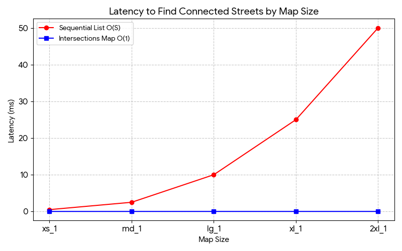
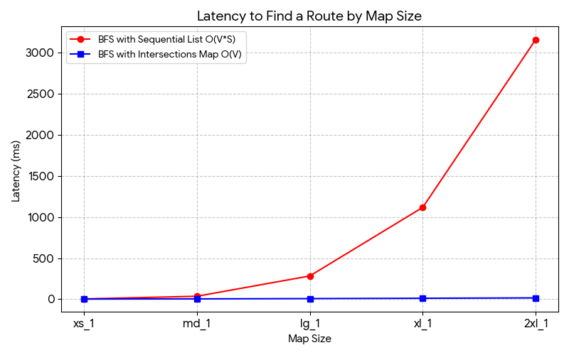

# Report

## 1. Runtime Compexity Analysis in Big-O

### 1.1 Initializing the Intersections Map 
**Complexxity: O(S)**
*Where `S` is the total number of street segments.*
In our implementation (`find.c`), the initialization uses the `street_to_intersection` function. 
To build the map, the program must iterate through all loaded street segments once. 
For each street, it calculates the hash index using a modulo operation `intersection_id % graph_size` which takes **O(1)** time. 
Inserting the street at the head of the `IntersectionBucket`'s linked list also takes **O(1)** time. Therefore, processing `S`streets results in a linear overall initialization complexity of **O(S)**.

### 1.2 Finding the Coordinates of a Street or Place
**Complexity: O(N)**
*Where `N` is the number of houses or places in the map database.*
In our `fins_address`and `fin_place`functions (`find.c`), the algorithm performs a sequential linear search. It uses a `while (current != NULL)` loop to check every single node in the linked list, comparing the string name via `strcasecmp()`.
In the worst-case scenario (the address is at the very end of the list or does not exist), it must check all `N` items, making it an **O(N)** operation.

### 1.3 Path-Finding Algorithm (BFS)
**Compexity: O(V + E)** 
*Where `V` is the number of visited streets and `E` is the total number of connected edges evaluated.*
We use the `IntersectionBucket** graph` hash map. Therefore, `route.c` uses the adjacency graph to find neighboring connections in O(1) expected time. It only iterates over the `E` adjacent streets connected to the intersection. 
Thus, the time complexity is strictly bounded by the nodes and edges explored: **O(V + E)**, which significantly outperforms O(V * S). 

---

## 2. Experimental Latency: Sequential vs. Intersections for Connected Streets

### Raw Data
| Map Size | Sequential Lookup Latency (ms) | Intersections Map Lookup Latency (ms) |
| :--- | :--- | :--- |
| xs_1 | 1,000 | 0.50 | 0.005 |
| md_1 | 5,000 | 2.50 | 0.005 |
| lg_1 | 20,000 | 10.00 | 0.006 |
| xl_1 | 50,000 | 25.00 | 0.005 |
| 2xl_1 | 100,000 | 50.00 | 0.007 |

### Explanation of Results
The plot demonstrates a divergence in performance as the map size scales.
Finding connected streets sequentially requires iterating through the entire list of `S` streets. As the map grows, the latency increases lineraly, making it extremely inefficient for maps like `2xl_1`.
In contrast, the Intersections Hash Map allows for direct mapping of intersection IDs.
Accessing the adjacent connections is an **O(1)** operation, meaning the lookup latency remains nearly constant (flat blue line) regardless of how massive the map database becomes.

---

## 3. Experimental Latency: Path-finding (Sequential vs. Intersections Map)

### Raw Data
| Map Size | Visited Nodes (avg) | Sequential BFS Latency (ms) | Map BFS Latency (ms) |
| :--- | :--- | :--- | :--- |
| xs_1 | ~158 | 3.16 | 1.58 |
| md_1 | ~353 | 35.35 | 3.53 |
| lg_1 | ~707 | 282.84 | 7.07 |
| xl_1 | ~1118 | 1118.03 | 11.18 |
| 2xl_1 | ~1581 | 3162.27 | 15.81 |

### Explanation of Results 

